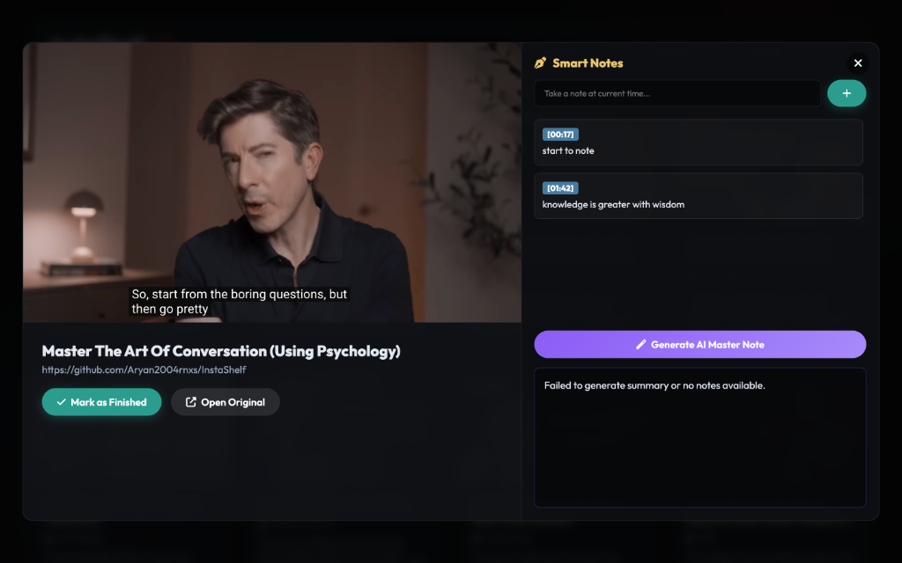
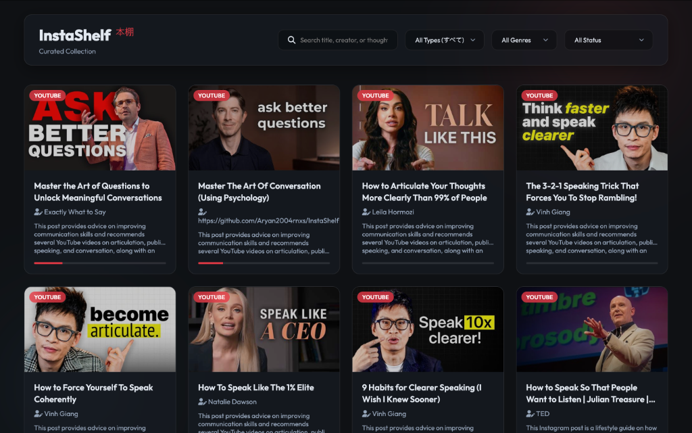
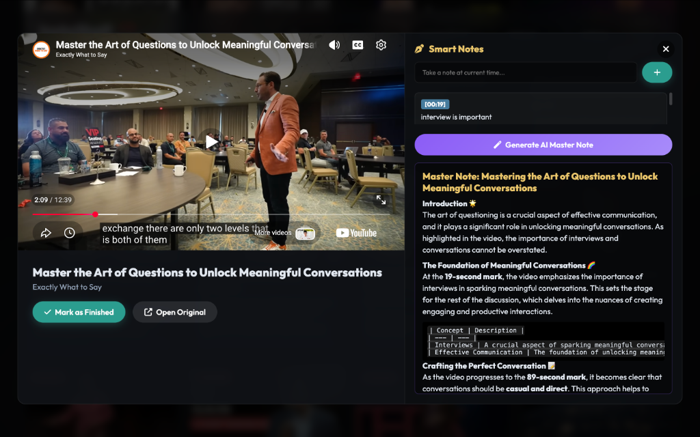

# InstaShelf 本棚

**Live Demo:** [https://aryanshinde-instashelf.hf.space/shelf](https://aryanshinde-instashelf.hf.space/shelf)

InstaShelf is an AI-powered personal knowledge management tool designed to capture, organize, and enrich educational content from social media platforms like Instagram and YouTube.

When you send a Reel or YouTube short to the InstaShelf Telegram bot, it automatically:
- Extracts the core knowledge using multimodal AI.
- Searches YouTube for the full original long-form video or podcast.
- Organizes everything into a beautiful, Japanese "Wabi-Sabi" inspired web dashboard.

### Features
- **Smart Enrichment:** Finds the original full-length video/podcast behind viral shorts.
- **Smart Notes:** Take timestamped notes seamlessly while watching the embedded video.
- **AI Master Notes:** Uses Groq and Gemini to automatically generate a comprehensive study guide from your raw notes.
- **Interactive UI:** Dynamic genre filtering, progress tracking, and a fully responsive premium layout.
- **Google Sheets Sync:** Automatically backs up all metadata and notes to your personal Google Sheet.

### Screenshots

### Technologies Used
- **Backend:** Python, FastAPI, python-telegram-bot
- **Frontend:** Vanilla JS, HTML5, Vanilla CSS3
- **AI/LLMs:** Google Gemini API (Multimodal Extraction), Groq AI (Fast processing)
- **Scraping/Enrichment:** Apify (Instagram Scraper), YouTube Data API v3, yt-dlp
- **Database:** SQLite (Local Caching), Google Sheets API (Persistence)
